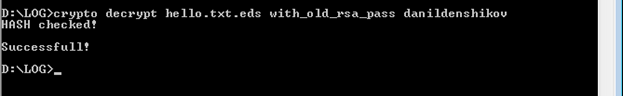

# cryptoSystem
комплексное шифрование файлов

### Функционал:
- блочный симметричный шифр ГОСТ 28147-89 (Magma)
- хэш-функция RipeMD
- ЭЦП RSA

### Примеры:
###### вызов справки (без параметров) и шифрование
<h4 align="center">
  
</h4>

###### файлы после шифрования
<h4 align="center">
  
</h4>

###### вызов дешифрования
<h4 align="center">
  
</h4>

###### расшифрованный файл
<h4 align="center">
  
</h4>
